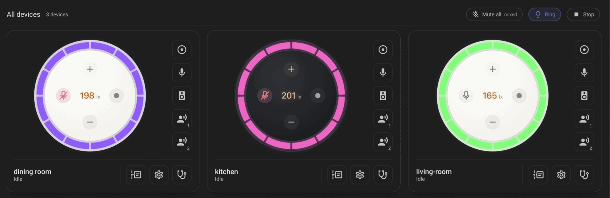
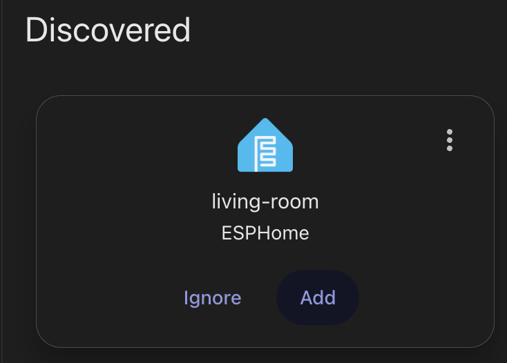
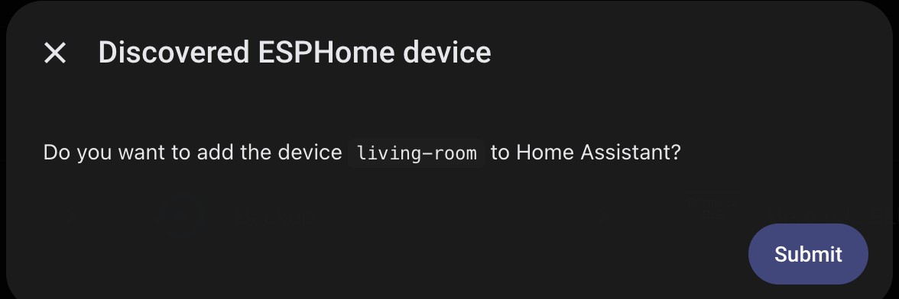

# EchoLocal

Upgrade your 2nd-generation Amazon Echo Dot (biscuit, RS03QR) into a local Home Assistant voice satellite (and more).

A pure-Go replacement for Amazon's services that speaks the ESPHome native API, so Home Assistant
discovers it the way it discovers any ESPHome device.

Requires a device unlocked with TWRP or similar — see [xdaforums](https://xdaforums.com/t/unlock-root-twrp-unbrick-amazon-echo-dot-2nd-gen-2016-biscuit.4761416/) for details.

## Includes:

**100% on-device local wake words.** Supports [openWakeWord](https://github.com/dscripka/openWakeWord)
and [microWakeWord](https://github.com/kahrendt/microWakeWord) models, including "stop" detection.

**LED ring.** Twelve individually addressable segments, multiple animation effects across ambient, motion, alert and
room-reactive behavior, and a color picker per segment. The ring can follow the room's volume.

**Speaker.** A native Home Assistant `media_player` — play any media Home Assistant can hand it.
Music can duck under a wake word, and resumes. Also supports white-noise generation.

**Bluetooth proxy.** BLE advertisements forwarded to Home Assistant, so the Dot extends your
Bluetooth and can be used in integrations like [bermuda](https://github.com/agittins/bermuda).
While the proxy is enabled, the Dot also advertises as an iBeacon with UUID
`9c5fa6f1-91c4-4f56-bb9f-d92acfd9d40b`, major `1`, and a minor derived from the final two bytes of
its factory MAC address. The beacon stops when the proxy is disabled. This supports tools such as
[BLE Positioning System](https://github.com/Hogster/BPS), which use the physical positions of BLE
receivers to locate tracked devices.

**Lux sensor.** The board carries an ambient light sensor that Amazon appears to have left unused.

## The optional integration

Everything above works with stock Home Assistant. The
[EchoLocal integration](https://github.com/ygelfand/echolocal-hacs) (HACS) adds optional functionality:

- a dashboard and cards built for these devices
- per-turn history
- play back of what the microphones heard
- a wake word library manager



## Installing

You need a 2nd-generation Echo Dot, connected via a USB cable, and a device that has been unlocked with TWRP as its
recovery partition. `echoctl` does the rest. It'll prompt for wifi configuration if it hasn't been setup and provide espHome encryption key

```sh
echoctl install --name living-room
```


It then turns up in Home Assistant on its own, and the key `echoctl` printed is what pairs it:

<p align="center">
  
  
</p>

## Building it yourself

```sh
make build-echod     # cross-compile the daemon for the Dot
make install-echod   # build, install, and restart it on a connected device
```

## How it fits together

- **echod** runs on the Dot: the hardware, the wake word engines, the conversation, and an ESPHome
  native API server.
- **echoctl** is the host CLI: installing, re-installing, provisioning, and offline tools for debugging the device.
- **[go-esphome-device](https://github.com/ygelfand/go-esphome-device)** implements the device half of
  the ESPHome protocol, including the voice satellite and Bluetooth proxy.
